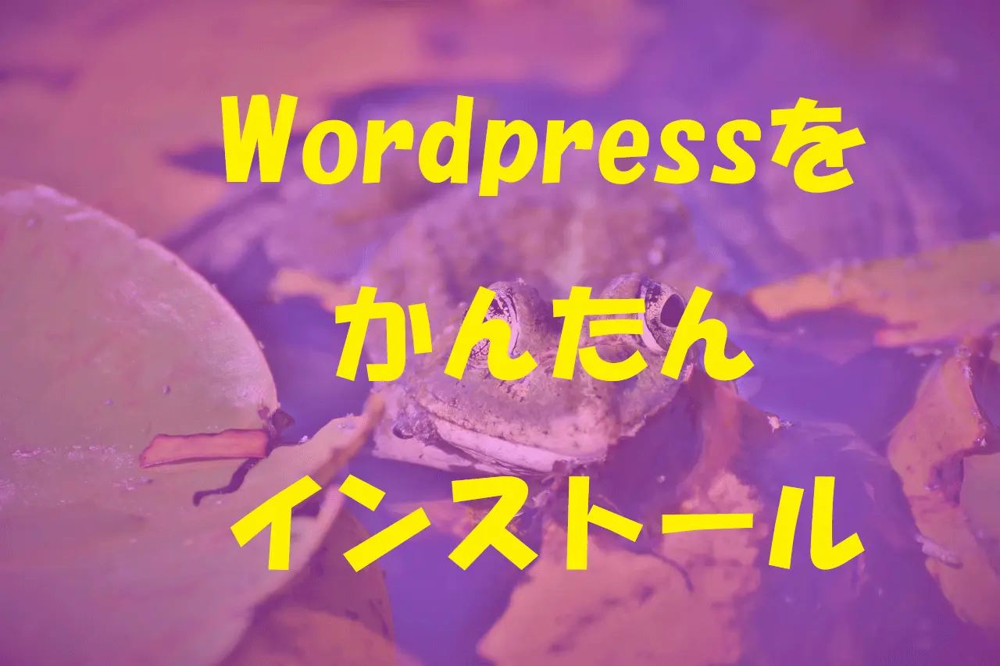

+++
date = '2024-02-05T18:38:47+09:00'
draft = false
title = 'ワードプレス運用状況'
categories = ["wordpress"]
thumbnail = "images/shared/screenshot-1.webp"
+++

## Wordpressを簡単インストール

新しいドメイン（snakewoman.blog）をお名前ドットコムで申し込んだら（０円）、サーバーまで申し込んで契約されていました（有料。(T_T)）

しばらく放置して解約するつもりだったのですが、せっかくなのでワードプレスを簡単インストールしてみました。

このテーマは『ブロックテーマ』です。

『ブロックテーマ』というのは最近、ワードプレスに導入された「ブロックエディタ用テーマ」のことです。（昔からのテーマは「クラシックテーマ」と言うようです。）

『ブロックテーマ』は、htmlやcssに詳しく無くてもテーマのカスタマイズが簡単にできます(\*^\_^\*)

ようやく、ブロックエディタの基本的使い方を覚えたので、面白いのでしばらくブログを頑張ってみようと思います！

＞＞ベストセラー

[

  
となりのトトロ \[DVD\]

**Amazonで見る**

](https://amzn.to/3SIWKcT)

＞＞ベストセラー

[

  
となりのトトロ \[DVD\]

**Amazonで見る**

](https://amzn.to/3T2gqZ7)
