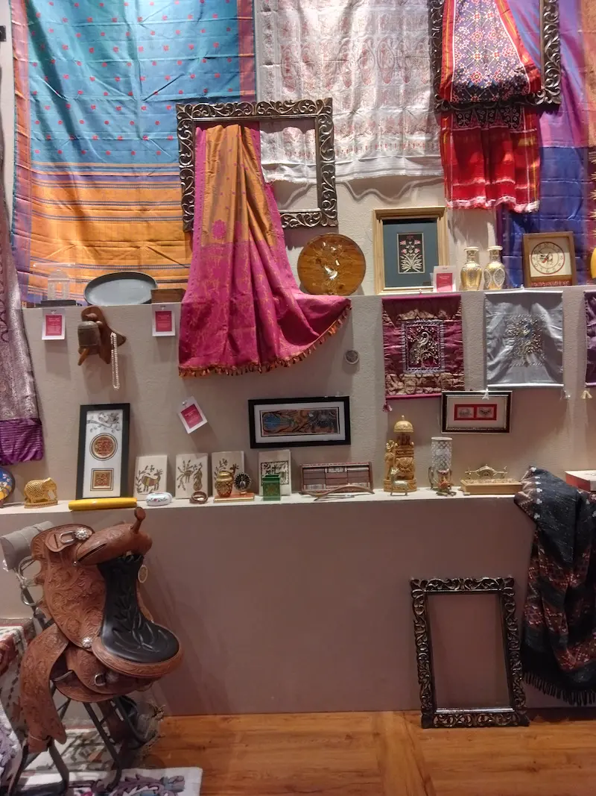
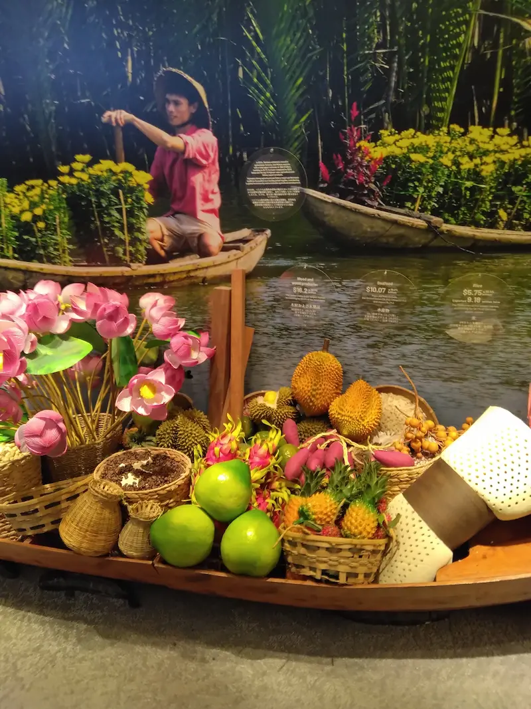
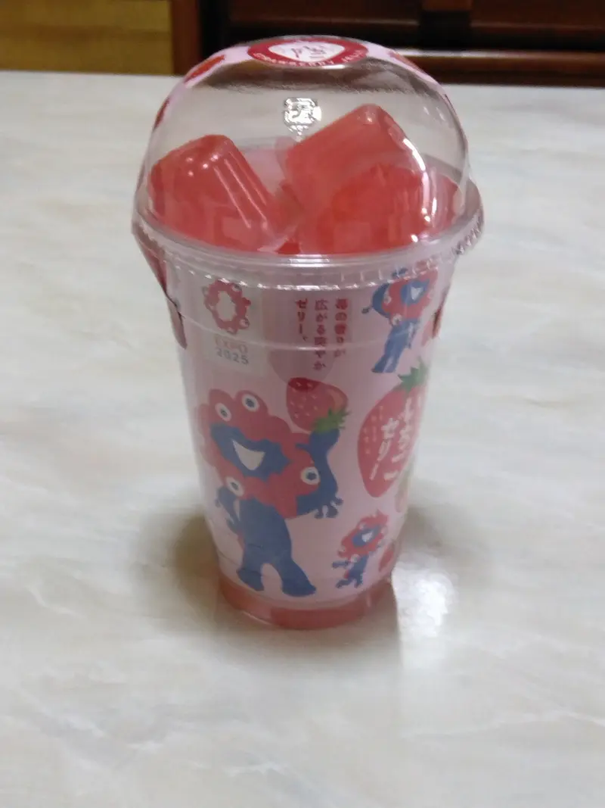
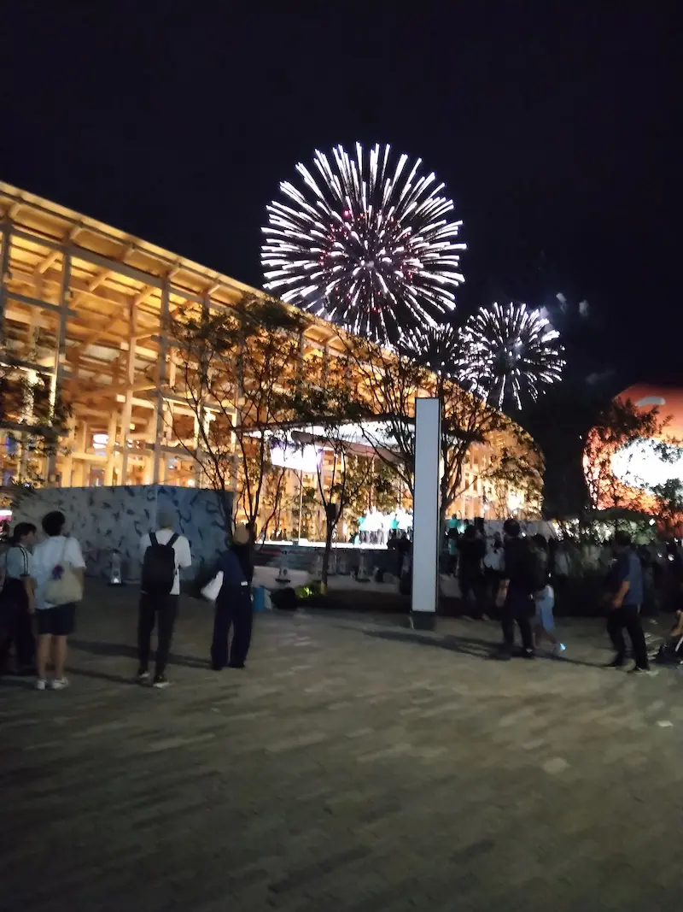

+++
date = '2025-10-12T15:50:52+09:00'
draft = false
title = '2025 大阪万博に行ってきました'
categories = ["diary"]
thumbnail = "images/somple3.webp"
+++

こんにちは！！

　ついに夢洲で開催中の「2025 大阪万博」に行ってきました。もうすでに昼間の入場チケットは満員だったので「10月11日(土) 夜間」にしました。

自宅からは、京阪電車で天満橋に行くルートが一番楽だと思ったのでそうしました。ちょっと早すぎるかなと思いながら午後1時半前に出かけました。（夕方17時開場です。）着くの早すぎる！！と思ったのですが（途中道を間違えて時間をくった(T_T)）ので着いた時間は丁度良かったです。

ひとりで行くので不安だったのですが、少し準備をして出かけたので大丈夫でした。久しぶりの遠出なので少し気分が悪くなったことが何回かありました。夕方からにもかかわらず、人はものすごく多いという印象です。とにかくどこをみるのも待ち時間があります。

　今回は予約が必要なパビリオンなどは無理だったので、ぶらりと散策するようなつもりでしたが、10月に入っているのにもかかわらず気温は高いし人波の熱気で異様な雰囲気に包まれていて、（みんなものすごい軽装やなぁ～。ほとんど普段着やん。）という印象。とにかく歩く距離が多く、へとへとになりました。

最初の予定

1.大屋根リングを散策して夜景を鑑賞

2.夕食

3.シグネチャーパビリオン１つを見学

4.ウォータープラザでイベントを鑑賞

5.お土産

6.帰路に着く

でしたが、3,4は予約がないのでだめでした。大屋根リングからエスカレーターで降りてから、開いているベンチで弁当を食べました。それからトイレに行って、予約なしでも入れるパビリオンを見学しました。行ったのは、インド館、夜の地球、ベトナム館です。

お土産を買うのも待ち行列で40分くらいかかりました。やっとこさ帰路につこうとしたら、夢洲の駅まででまた待ち行列。会場ではお土産の行列の時点で「電車での帰宅が困難になる可能性がありますので、別の手段も検討してください」と言われていました。これはパニックになって何か事故が起こることを懸念しておおげさに警告したようです。（将棋倒しとか。）

そしてやっとこさ電車に乗り込んでそれぞれの帰路に向かいました。

大阪の万博。

私の年代ではかつて「エキスポランド」に名称変更した、1970年開催の万博会場に家族4人で訪れた昔から比べると、時代の流れというものを感じさせるものでした。日本人が主体の世の中ではなくなってきたしコミュニケーションの手段も増えてどれを選ぶかは自由。この万博で日本がまた価値観の違う新しい時代を作り出す一歩になればいいと思いました。

Catching the last magic of Expo 2025. （2025年万博、最後の魔法に間に合って）

Colorful details from India Pavilion. （インド館の色鮮やかなディテール）

The exotic atmosphere of the Vietnam Pavilion. （ベトナム館のエキゾチックな雰囲気）

The Earth Pavilion glowing in the dark. （闇の中で輝く地球館）

Small souvenirs to remember the day. （この日を忘れないための、小さなおみやげ）

A short but unforgettable evening. （短かったけれど、忘れられない夕べ）

So glad I made it before it closed. （閉幕前に来られて本当によかった）

**Finally, I’m so glad I made it to the Expo.** （最後になりましたが、万博に行けて本当によかったです。） **These short moments will stay with me forever.** （この短い時間は、私の中でずっと大切な思い出になります。）
